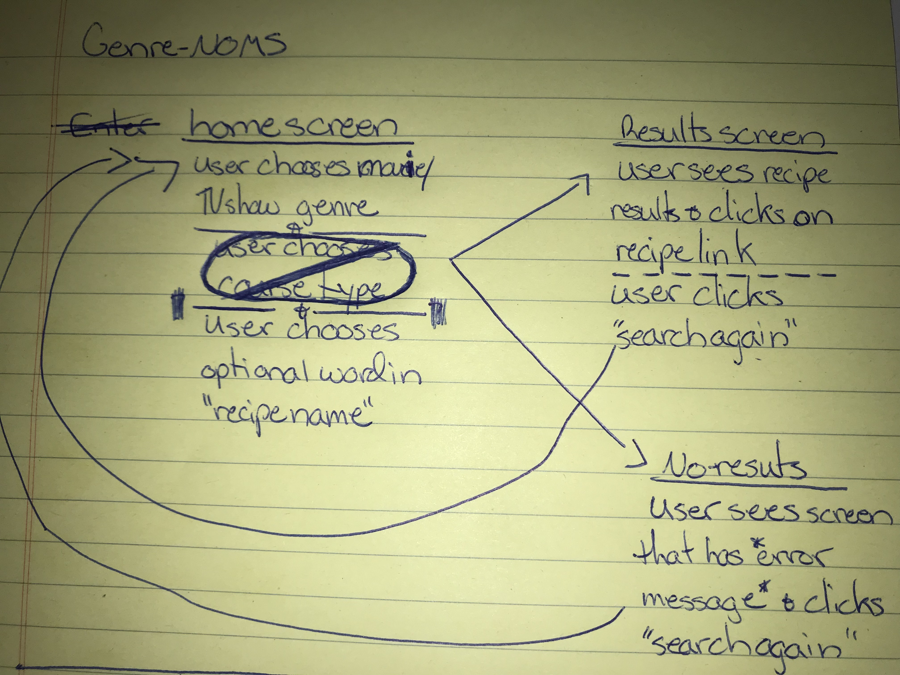
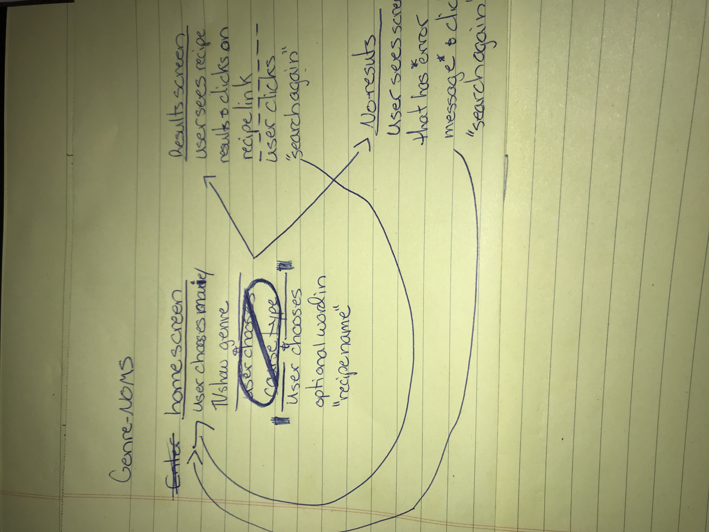
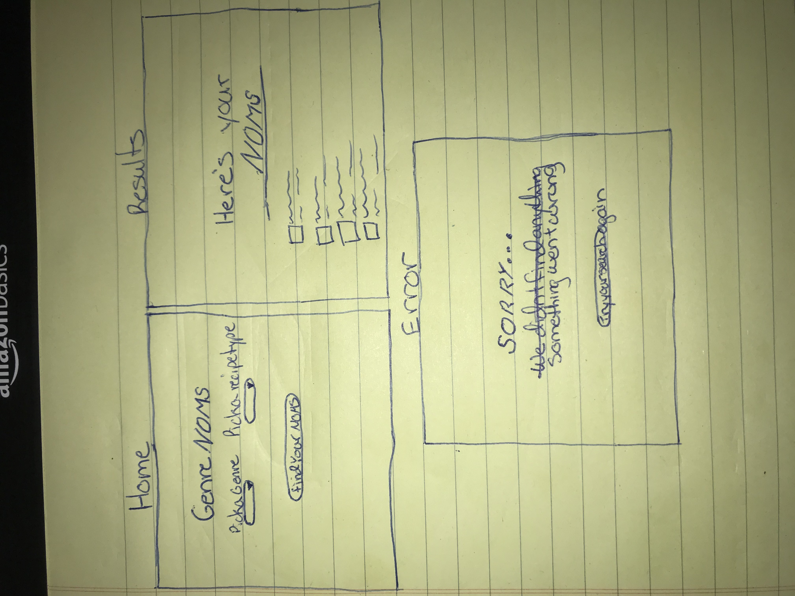
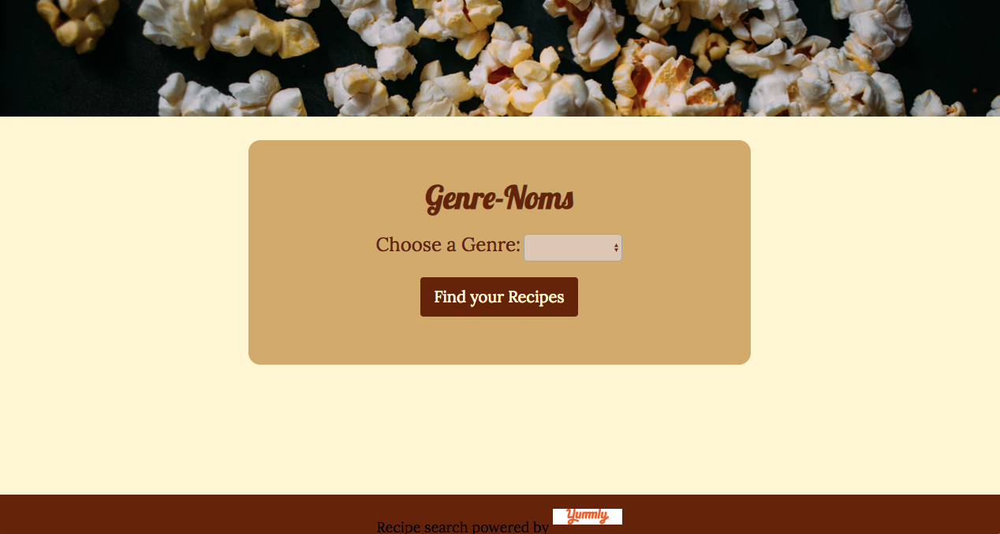
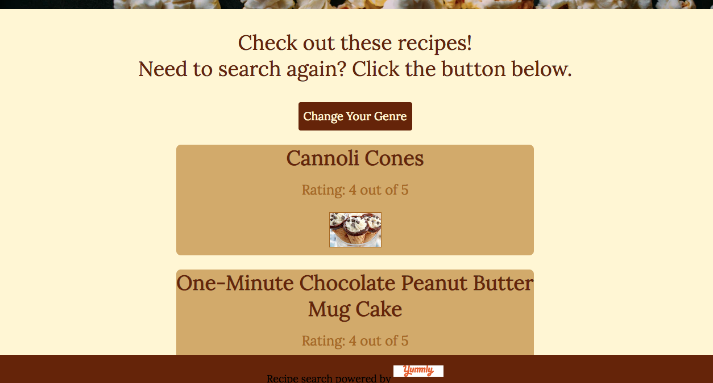

# genre-noms-api-capstone

API Hack for Thinkful's 1st capstone project

Genre-NOMS is the app for those who love to cook a delicious meal while watching their favorite Movie or Series. Simply choose the movie/show's genre and Genre-NOMS will give you a list of recipes designed to go perfectly with your evening's entertainment.

User Flows and Wireframes:

Screen Shots:

Changes were made during developement so that the end flow of the app does  not match the flow charts, wire frames or screen shots.

Technologies Used:
- HTML
- CSS
- JavaScript
- jQuery
